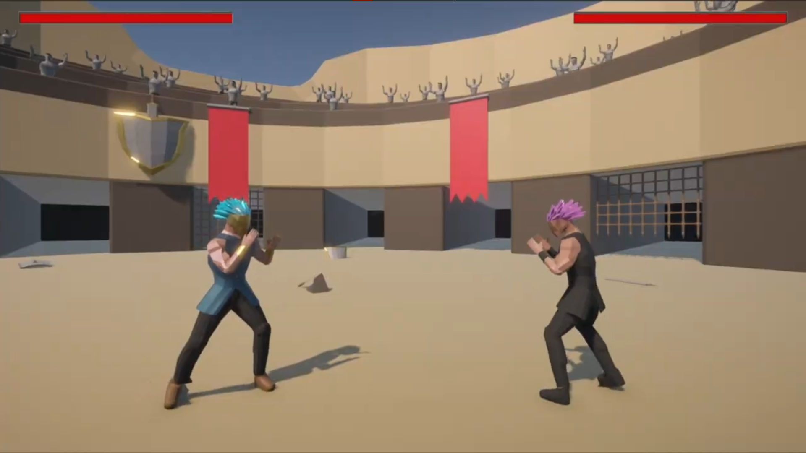
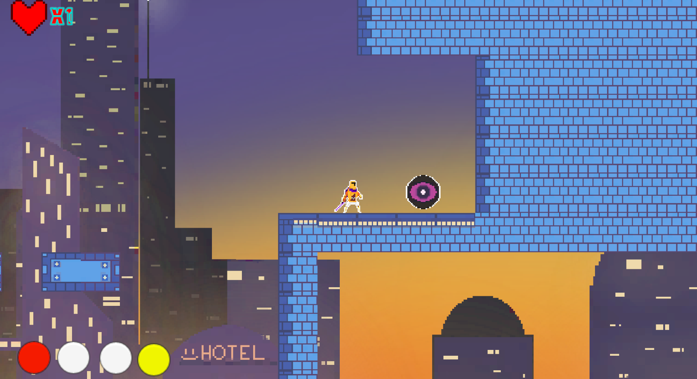
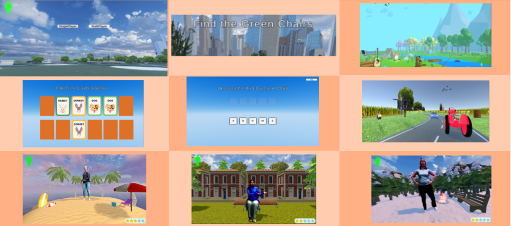

# Sunu Pious Joseph

🎮 **Game Developer** | 💻 **Software Engineer**  
📍 Toronto, ON | ✉️ [sunupiousjoseph@gmail.com](mailto:sunupiousjoseph@gmail.com)  
🌐 [GitHub](https://github.com/sunujoseph) | [LinkedIn](https://www.linkedin.com/in/sunu-joseph/)  

---

## 👋 About Me

I'm a dual-degree graduate from Ontario Tech University with Honours in both **Computer Science** and **Game Development & Interactive Media**. I’ve developed immersive games, VR simulations, and real-time tools using Unity, C++, Python, Blender, and OpenCV. My focus is on building accessible, creative, and performance-optimized interactive systems.

---

## 🎮 Games Published on Itch.io

### 🔹 Put Yourself In The Game 2D (Custom Animator)

**Role:** Programmer

**Play Links:**  
🔗 [Feb 21 Event](https://gdimcommunityactivities.itch.io/put-yourself-in-the-game-2d-gdim-activity-feb-21)  
🔗 [Feb 22 Event](https://gdimcommunityactivities.itch.io/event-put-yourself-in-the-game-thurs-feb-22-2024)

### 🔹 Fighter Frenzy

**Role:** Programmer / 3D Animator

**Play Link:**  
🔗 [Fighter Frenzy on Itch.io](https://yorgi11.itch.io/fighter-frenzy)

  
▶️ [Watch Gameplay on YouTube](https://www.youtube.com/watch?v=GL_rGnmflYU)

---

### 🔹 CyberRift: The Fractured Path

**Role:** Programmer / Game Designer

**Play Link:**  
🔗 [CyberRift on Itch.io](https://farhaniboii.itch.io/cyberrift-the-fractured-path)

  
▶️ [Watch Gameplay on YouTube](https://www.youtube.com/watch?v=J02vI8q2crk)

---

## 🎓 Capstone 2025

### 🔹 [Zumba Game for Dementia Study (GitHub)](https://github.com/sunujoseph/Zumba-Game)  
**Role:** Lead Programmer  
A Unity-based exergame using Azure Kinect for memory stimulation and physical activity for dementia patients.

---

## 📫 Contact Me

I’m open to opportunities in game development, interactive media, and software engineering.  
Feel free to connect or reach out!

